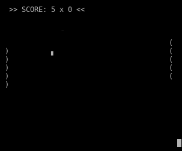

# Pong Game NodeJS/Terminal
Classic Pong Game, implemented with pure JavaScript in NodeJS and played in terminal.



***Disclaimer**: Only tested in Ubuntu Environment*

# How to Play
- Player 1 (left) use **a** and **z** to move up/down.  
- Player 2 (right) use **up arrow** and **down arrow** to move up/down.

# How to Run
```
node index.js
```
